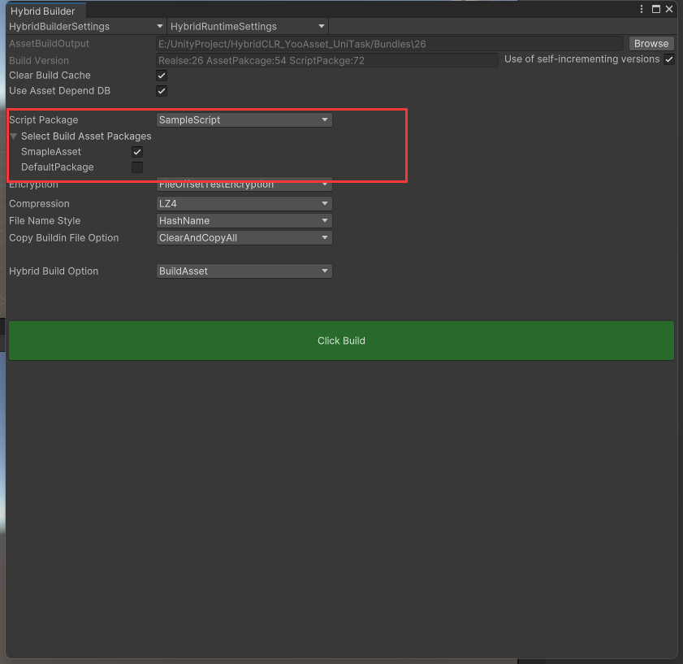

# README_Release2025


## 首先需要明确的概念


本仓库基于`Unity2022.3.5.7f1c2` ,`HybridCLR8.2.0`,``YooAsset2.3.9`,`UniTask2.5.10`版本进行整合

提供一个较为简单的上手文档


### Assembly-CSharp.dll

`Assembly-Csharp`为Unity自动整合的dll,在Unity工程中任何没有被单独编译的代码都会被整合进这个`Assembly-CSharp.dll`中


### Assembly Definition

`Assembly Definition`是Unity2017.3以后出的一个功能,主要在于解决庞大的程序集编译时效问题

在Assets目录下任意一个文件夹创建一个`Assembly Definition`,会使得该文件夹下所有的代码单独编译成一个dll,并且修改该文件夹下代码时,只会重新编译该dll,而不会重新编译`Assembly-CSharp.dll`

当我们划分AOT程序集以及热更新程序集时,可以用到该功能


### AOT与热更新程序集

#### 热更新程序集

热更新程序集理论上可以是`Assembly-CSharp`程序集,但是为了保证项目逻辑清晰,资源管理方便,当前框架使用`AssemblyDefinition`划分单独的dll作为热更新程序集,热更新assembly不应该被il2cpp处理并且编译到最终的包体里。

HybridCLR处理了`IFilterBuildAssemblies`回调, 将热更新dll从`build assemblies`列表移除


#### AOT程序集

AOT程序集是随包一起打出,不会被更新的代码

在当前仓库定义下,`Assembly-CSharp`为主AOT程序集,用`AssemblyDefinition`划分其他AOT程序集

把`Assembly-CSharp`作为AOT程序集时强烈建议关闭热更新程序集的`auto reference`选项。因为`Assembly-CSharp`是最顶层assembly,它会自动引用剩余所有assembly,很容易就出现失误引用热更新程序集的情况。


### UniTask

UniTask是Github上的开源库,为Unity提供一个高性能异步方案,可以代替协程实现异步操作,同时兼容Unity生命周期,使得Awake,Start,协程等方法都可以异步执行,但是仍然运行在主线程上


### 热更新DLL的加载

HybridCLR官方推荐直接代码直接挂载在预制体上,通过AssetBundle加载预制体的方法进行加载热更新,但是也可以通过从加载的热更新dll中直接反射出热更新类并AddComponent方法挂载到这个物体上,以实现热更新,无论哪种方式,都需要在加载预制体或者加载类之前,提前加载好热更新的Dll


### HybridCLR打包流程

需要在HybridCLR-Settings中将所有热更新的`AssemblyDefinition`加入列表`hotUpdateAssemblyDefinitions`|`hotUpdateAssemblies`

`hotUpdateAssemblyDefinitions`和`hotUpdateAssemblies`合并后构成最终的热更新dll列表。同一个assembly不要在两个列表中同时出现,会报错！


`HybridCLR.Editor`程序集提供了`HybridCLR.Editor.Commands.CompileDllCommand.CompileDll(BuildTarget target)`接口, 方便开发者灵活地自行编译热更新dll。编译完成后的热更新dll会自动的放到 `{project}/HybridCLRData/HotUpdateDlls/{platform}` 目录下。


在打包AssetBundle前,应将热更新DLL作为RawFile放入可被`YooAsset.AssetBundleCollector`收集的目录下

虽然 `{project}/HybridCLRData/HotUpdateDlls/{platform}`目录下有许多Dll,但是只需要拷贝我们在HybridCLR-Settings中配置的DLL到`YooAsset.AssetBundleCollector`目录下即可


HybridCLR在每次出包时,需要编译热更新代码,执行`CompileDll-ActivityTarget`打包出DLL,修改后缀名后,作为RawFile打包


### 初次运行工程

1. 执行`HybridCLR-Installer`安装HybridCLR环境
2. 在`YooAsset-AssetBundleCollector`中配置资源与代码包
3. 通过`Project-Create-ScriptableObject`创建`HybridBuilderSettings`与`HybridRuntimeSettings`
4. 在StartScene的Boot物体上,配置`YooAsset运行模式`,如果是`HostPlayMode`,则需要添加`HybridRuntimeSettings`
5. 通过`顶部菜单栏-HybridTool-HybridBuilder`进行打包配置,并进行打包

## HybridTool

因为YooAssets和HybridCLR都是通过UnityPackageManager加载的,导致很多代码不够好用又无法修改,所以通过编辑器代码写了一套整合工具,使得两个第三方库可以配合的更好

### 验证元数据是否需要补充

通过对比AOTDLL和HotUpdateDLL得出AOTDLL是否需要补充元数据

该方法不会自动发AOTDLL生成或HotUpdateDLL生成,因此如果要用于测试,仅代表当前的状态

### 打APK包

测试打APK流程

在打APK前会先执行

```
//如果是生成代码，则只需要更新AOT和热更新代码即可
Il2CppDefGeneratorCommand.GenerateIl2CppDef();
//由于该方法中已经执行了生成热更新dll，因此无需重复执行生成热更新DLL
LinkGeneratorCommand.GenerateLinkXml();
    
//补全热更新预制体依赖
BuildHelper.SupplementPrefabDependent();
```


### 获取需要补充元数据的DLL

先执行`CompileDllCommand.CompileDllActiveBuildTarget`获取当前最新的热更新代码,随后通过对比当前`HybridCLRData/AssembliesPostIl2CppStrip`目录下的AOTDLL,获取需要补充元数据的AOTDLL名称列表,并写入`HybridCLRSettings`中

由于`HybridCLRData/AssembliesPostIl2CppStrip`目录下的AOTDLL需要通过打包得到,因此仅代表执行该方法时,需要补充元数据的AOTDLL


### 生成AOT补充文件并复制进文件夹

按顺序执行以下命令后,将AOTDLL复制到指定目录

```
//先生成AOT文件
Il2CppDefGeneratorCommand.GenerateIl2CppDef();
LinkGeneratorCommand.GenerateLinkXml();
StripAOTDllCommand.GenerateStripedAOTDlls();
```

由于`GenerateStripedAOTDlls`会导致一次打包动作,因此获得AOTDLL应和打包APK时一致


### 生成热更新Dll并复制进文件夹

同上


### 补全热更新预制体依赖

通过反射HotUpdateAssets目录下所有的预制体身上的组件,以及组件的属性,来补充Link.xml,以避免部分非直接引用的类型被裁剪的问题


## HybridBuilderWindow

重写基于UIToolKit的`YooAsset.AssetBundleBuilderWindow`,并增加了一些有关代码打包的设置项

实现类为`HybridBuilderWindow`类,UIToolKit资产为`HybridBuilderWIndow`

除ToolBar之外的所有内容均来自`HybridBuildPipeViewerBase`


###  ToolBar

第一个枚举类型为工程中所有的`HybirdBuilderSettings`对象

第二个枚举类型为工程中所有的`HybridRuntimeSettings`对象

通过配置不同的`HybirdBuilderSettings`和`HybridRuntimeSettings`,可以灵活的配置打包结构


### HybridRuntimeSettings

包含HostServiceIP,需要加载的包名列表,以及对应的版本

在`HybridScriptableBuildPipelineViewer`成功构建后,序列化为JSON格式并写入到`RuntimeSettingsPath`路径下

用于加载一部分Runtime需要用到的设置


### BuildVersion

虽然可以通过旁边的Toggle切换两种版本的显示,实际上在构建时使用到的版本均是`HybirdBuilderSettings`中的版本

该界面只用于预览版本,实际上无论如何选择,都将使用HybridBuilderSeetings中的版本打包


### ScriptPackage & AsssetPakcage

由于YooAsset新版本加载RawFile需要RawFileBuildPipeline打包,因此最少需要区分两个不同的AssetBundle,一个用于打包资产,一个用于打包脚本

当项目中少于2个Packages,会导致报错




此处可选的Package是通过扫描整个工程得到

如果打包Asset,则要求必须选中一个Package


### PatchedAOTDLLFolder&HotUpdateDLLFolder

此处需要注意,不要和AssetBundleCollector中其他文件夹相同,应保证独特性,需要自行检查是否真的为对应的AssetBundle打包路径

该变量只用于判断打包热更新代码时,AssetBundleCollector中是否已经收集了代码的打包路径


## HybrdiScriptableBuildPipeline

主要打包逻辑是在`HybridScriptableBuildPipelineViewer`中实现

仅在运行时对打包Asset或Script进行了区分使用`YooAsset.ScriptableBuildPipeline`还是`YooAsset.RawFileBuildPipeline`

并在`RawFileBuildPipeline`的打包流程中增加了`TaskBuildScript_SBP`流程


对`YooAsset`打包流程作出了一点修改

1. 运行时对打包Asset或Script进行了区分使用`YooAsset.ScriptableBuildPipeline`还是`YooAsset.RawFileBuildPipeline`,由此引申出两个不同的版本,即代码版本和资源版本

2. 在`RawFileBuildPipeline`的打包流程中增加了`TaskBuildScript_SBP`流程

3. 通过包名列表配置一次性打多个包,并共用资源版本号

4. 由于`HybridCLR`在执行`HybridCLR/Generate/AotDlls`时会导出一次工程,所以优化了打APK时的流程,当执行`BuildApplication`时,先打APK包,后打热更新代码包,这样就免去了执行`HybridCLR/Generate/AotDlls`时的导出工程操作,直接可以获得本次打包的裁剪后的`AOTDLL`

5. 在`BuildScript`之前,通过判断热更新代码是否访问了被裁切代码,来判断本次是否应该打包,如果访问了被裁切代码,应该重新BuildApplication

   


### TaskBuildScript_SBP

由于每次执行`StripAOTDllCommand.GenerateStripedAOTDlls`都会导致一次构建应用,为了避免构建时间过长

正常构建热更新代码时只需要执行`CompileDllCommand.CompileDllActiveBuildTarget`获取最新的热更新DLL即可


## HybridLuncher

该类为重写后的启动类,主要适配了代码的初始化流程

注意通过手机使用HTTP访问电脑地址时需要关闭电脑防火墙


### LoadHybridRuntimeSettings

通过访问`RuntimeSettingsPath`下载并反序列化`HybridRuntimeSettings`来获取一些运行时的设置


### FsmInitializePackage

修改了GetHostServerURL的拼接方式


### GameManager

当收到`ChangeToHomeScene`事件时,切换到热更新场景


### LoadMetadataForAOTAssemblies

从ScriptPackage中加载补充元数据程序集


### LoadHotUpdateAssemblies

从ScriptPackage中加载热更新程序集


## 项目文件结构

```
📁 Project
├── Asset
│   ├── AOTSciprt 同时用于AOT和HotUpdateDLL使用的类
│   ├── Editor 
│   │   ├── BuildPipelineTask   重写后的打包流水线Task类
│   │   └── ScriptableBuildPipeline   重写后的打包流水线
│   ├── HotUpdateAssets  用于打成AB包的所有美术和代码资产 
│   └── HotUpdateScripts  使用AssemblyDefition划分的热更新代码 
├── HybridCLRData  HybridCLR生成的文件夹
│   ├── AssembliesPostIl2CppStrip  打包后自动从Library拷贝出来的,被裁剪的AOTDLL
│   └── HotUpdateDlls HybridCLR生成的热更新DLL
├── Bundles  YooAsset默认打包路径
├── README.md
└── .gitignore
```


## 构建流程

打包前配置好`HybridLauncher.RuntimeSettingsPath` 以用于访问`HybridRuntimeSettings`

由于`HybridRuntimeSettings`是存在资源服务器的JSON文件,因此后续加载路径在`HybridRuntimeSettings`中配置即可


在`HybridBuilderWindow`中配置好打包参数后

当点击HybridBuilder中的Build Button时,会执行`HybridScriptableBuildPipelineViewer.ExecuteBuild`

通过`HybridBuilderSetting`中的`HybridBuildOption`,来决定当前的构建流程,只要成功构建,就会将`HybridRuntimeSettings`序列化为JSON并输出在指定路径下


### 如何判断什么时候应该构建APK?

可以通过`BuildHelper.CheckAccessMissingMetadata`来判断,热更新代码是否引用了被裁减的类型

如果是,则需要重新生成`LinkXml`并构建APK

桥接函数发生变化时,也需要重新构建APK

根据桥接函数的原理，对于固定的AOT部分，桥接函数集是确定的，后续无论进行任何热更新，都不会需要新的额外桥接函数。**因此不用担心热更上线后突然出现桥接函数缺失的问题。**

因此,在AOT稳定的情况下,只需要更新热更新部分的代码即可


### 如何增量打包?

由于YooAsset更改了增量打包的方式,因此每次打包都可以通过选项来配置是否增量打包

**Clear Build Cache**

清理构建缓存，将会重新构建所有资源包。

当不勾选此项的时候，引擎会开启增量打包模式，会极大提高构建速度！


## 代码裁剪补充说明

### Unity的代码裁剪

Unity代码裁剪工具会分析项目中的程序集,查找和删除未使用的代码. 裁剪掉没有使用到的代码

### link.xml

Unity提供了一个方式来告诉Unity引擎,哪些类型是不能够被剪裁掉的。具体做法就是在Unity工程的Assets目录中建立一个叫link.xml的XML文件,然后按照下面的格式指定你需要保留的类型：

```
<linker>
  <assembly fullname="UnityEngine" preserve="all"/>
  <assembly fullname="Assembly-CSharp">
    <namespace fullname="MyGame.Utils" preserve="all"/>
    <type fullname="MyGame.SomeClass" preserve="all"/>
  </assembly>  
</linker>
```

### HybridCLR生成的link.xml

HybridCLR自带的生成工具可以自动引用热更新及AOT代码中的类,并添加到link.xml中,但是无法获取热更新预制体身上已挂在的,但没有在代码中显式调用的组件

例如：假设一个热更新的预制体上挂载了Animator组件,那么AnimationClip类会被裁剪掉,或者预制体挂载了Rigibody组件,那么PhysicsMaterial类会被裁剪掉,并报出一个错误,提示你关闭代码裁剪

### 整合工具-补全热更新预制体依赖

该方法会遍历特定路径下,所有的后缀名为prefab的物体,并获取它们身上的组件,再从组件中获取属性,如果属性为Unity对象类型,则再获取一次属性,之所以需要再获取一次属性,是因为AnimationClip类在Animator中没有直接被引用,而是在RuntimeAnimator中引用,所以需要获取两层引用,具体获取几次,需要按照项目的需要进行改动

接着读取HybridCLR生成的link.xml,添加之前没有被添加过的程序集和类名

并存入Assets/link.xml路径,此时,项目中有两个link.xml,Assets路径下的link.xml包含了HybridCLR生成的类型,所以可以将原本的删除

如果不删除的话,Unity也会自动合并link.xml

通过该方法,可以解决一部分预制体挂载组件没有被显式调用导致被裁剪的问题

### 代码裁剪补全方式的选择

https://docs.unity.cn/cn/2020.3/Manual/ManagedCodeStripping.html

代码裁剪补全大概有四种方式

1. 打包后查看报错,在Unity官方文档中查找对应的类型,再在热更新代码中显式调用对应类型,使用HybridCLR-Generate-link.xml来生成

这种方式对包体影响最小,可以达到最小化的包体,但是还是可能因为组件的引用问题,导致需要多次打包查看报错

2. 打包后查看报错,在Unity官方文档中查找对应的类型,再直接修改`HybridCLR`已生成的`link.xml`

这种方式基本等同与上个方式,但是不需要在代码中添加额外的引用,可以更简洁

3. 直接关闭代码裁剪,会导致包体大5M左右,这种方式最方便
4. 使用整合工具-补全热更新预制体依赖,这种方式可以在AOT更新前,人为的将所有没有被HybridCLR引用的组件和类添加到link.xml中,在我的测试中,包体大概大了400K左右,大概处于较方便,且对包体影响较小,还能保持代码的简洁,缺点就是可能会添加很多无用的类进link.xml中,且需要根据项目手动的修改方法

## 相关文档引用

### HybridCLR

https://hybridclr.doc.code-philosophy.com/#/README

### YooAsset

https://www.yooasset.com/docs/Introduce

### UniTask

https://github.com/Cysharp/UniTask/blob/master/README_CN.md
